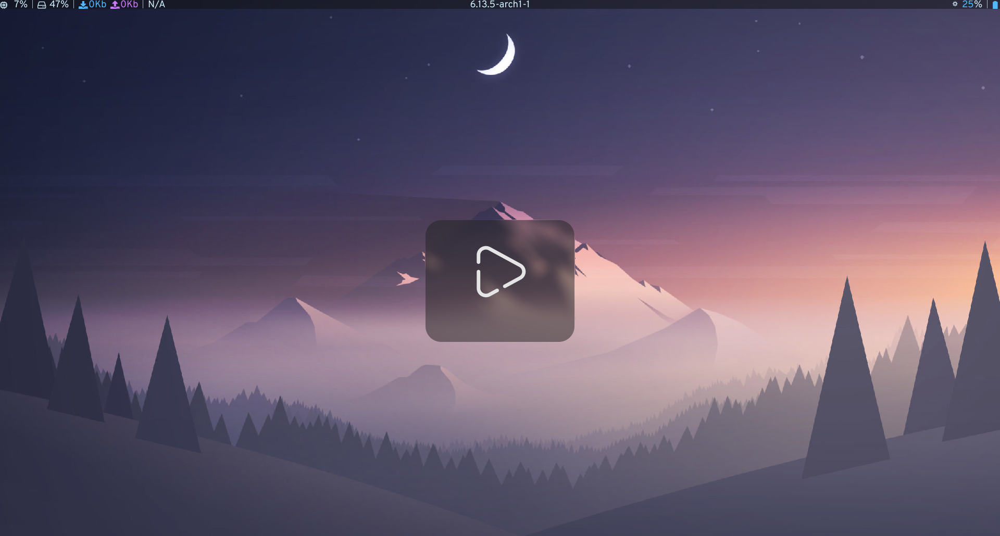
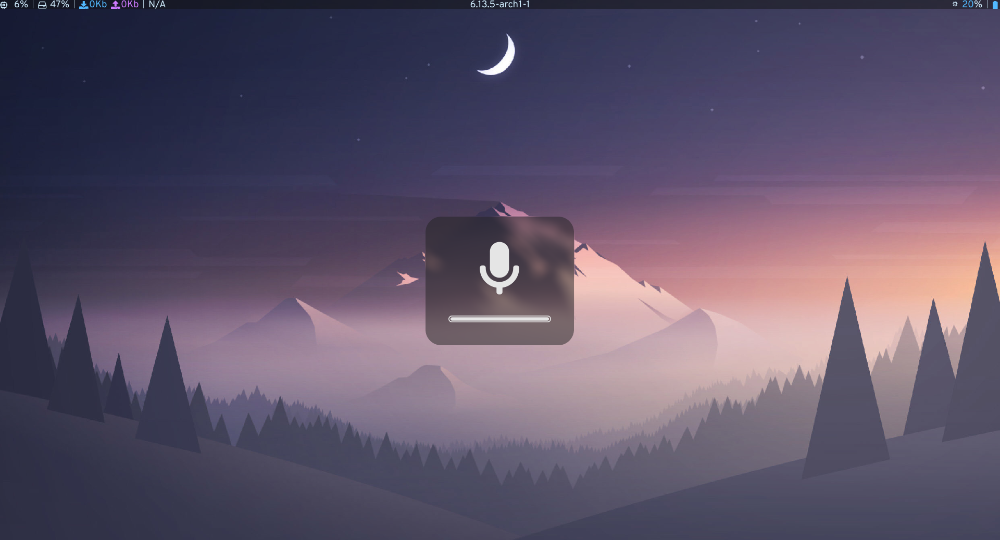
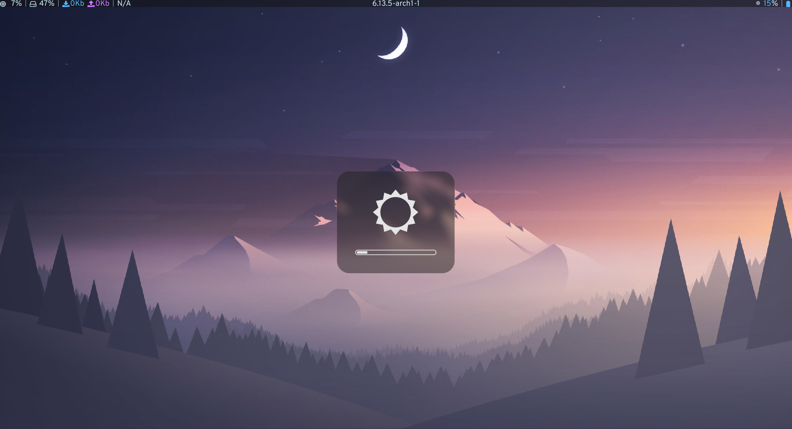
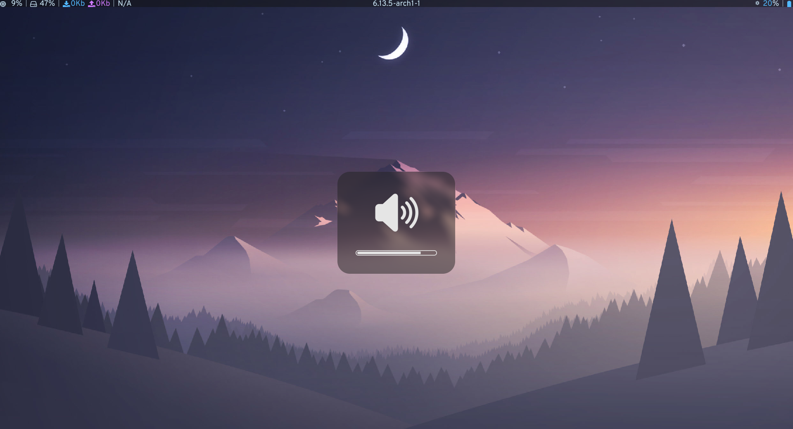
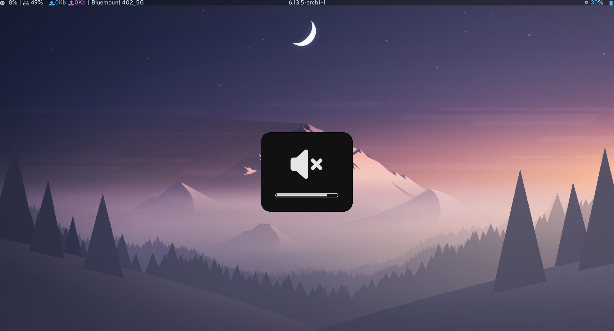

# Volnoti

Volnoti is a lightweight volume notification daemon for GNU/Linux and
other POSIX operating systems. It is based on GTK+ and D-Bus and should
work with any sensible window manager. The original aim was to create
a volume notification daemon for lightweight window managers like LXDE
or XMonad. It is known to work with a wide range of WMs, including
GNOME, KDE, Xfce, LXDE, XMonad, i3 and many others. The source code
is heavily based on the GNOME notification-daemon.

## Screenshots

| Previous                           | Play                           | Pause                           |
| ---------------------------------- | ------------------------------ | ------------------------------- |
|  |  |  |

| Next                           | Mic muted                           | Mic unmuted                           |
| ------------------------------ | ----------------------------------- | ------------------------------------- |
|  |  |  |

| Brightness                           | Volume high                           | Volume muted, no compositer                          |
| ------------------------------------ | ------------------------------------- | ---------------------------------------------------- |
|  |  |  |

You can find all the icons used under the [res](./res/) folder

## Why another fork?

The original repo https://github.com/davidbrazdil/volnoti has had no signs of activity since the last decade. This fork incorporates some of the pull requests from the original repo that seemed to be useful:

-   [Option for brightness](https://github.com/davidbrazdil/volnoti/pull/14)
-   [Option for mic mute and unmute](https://github.com/davidbrazdil/volnoti/pull/18)
-   [Generating value-\*-stub.h ??](https://github.com/davidbrazdil/volnoti/pull/7)
-   [Allow one decimal place to daemon's --timeout argument](https://github.com/davidbrazdil/volnoti/pull/5)

along with some other feature(s) that I wanted:

-   [Option for showing any icon after the daemon is started](#custom-activity-icons-at-runtime)
-   [Hide the progressbar for an icon](#no-progressbar)
-   [Custom text beneath the progressbar](#labels)

Other changes to the project include help message changes, change in an error message, changed icons and an updated PKGBUILD file for arch linux (not in AUR).

## Distribution packages

-   Arch Linux

## Dependencies

You need the following libraries to compile Volnoti yourself. Please
install them through the package manager of your distribution, or follow
installation instructions on the projects' websites.

-   [D-Bus](http://dbus.freedesktop.org)
-   [D-Bus Glib](http://dbus.freedesktop.org/releases/dbus-glib)
-   [GTK+ 2.0](http://www.gtk.org)
-   [GDK-Pixbuf 2.0](http://www.gtk.org)

You can compile it with standard `GCC`, with `make` and `pkg-config`
installed, and you will need `autoconf` and `automake` if you choose
to compile the Git version.

## Compilation from Git

Start by downloading the source code from GitHub:

    $ git clone git://github.com/davidbrazdil/volnoti.git
    $ cd volnoti

Let Autotools create the configuration scripts:

    $ ./prepare.sh

Then just follow the basic GNU routine:

    $ ./configure --prefix=/usr
    $ make
    $ sudo make install

You can have the `.tar.gz` source archive prepared simply by calling
a provided script:

    $ ./package.sh

## Compilation from source archive

Download the `.tar.gz` source archive from the GitHub page, and then
extract its contents by calling:

    $ tar xvzf volnoti-*.tar.gz

Then just follow the basic GNU routine:

    $ ./configure --prefix=/usr
    $ make
    $ sudo make install

## Running the application

Firstly, you need to running the daemon (add it to your startup
applications):

    $ volnoti

Consult the output of `volnoti --help` if you want to see debug output
ot don't want the application to run as a daemon. You can also change
some parameters of the notifications (like their duration time) through
the parameters of the daemon.

The best way to use volnoti is to create a simple script and attach it to
the hot-keys on your keyboard. But this depends on your window manager
and system configuration.

Once the daemon is running, you can run for example:

    $ volnoti-show 25

to show a notification for volume level 25%. To show a notification for
muted sound, call:

    $ volnoti-show -m

To show a notification for muted microphone, run:

    $ volnoti-show -c

To show a notification for un-muted microphone, run:

    $ volnoti-show -u

To show a notification for brightness level 50%, run:

    $ volnoti-show -b 50

### Custom activity icons at runtime

To show a notification for a custom activity, you can pass the absolute path to the icon with:

    $ volnoti-show -p /home/chad/svgs/gaming.svg

This option can also take an integer for the progressbar value. (Default value for the progressbar is 0):

    $ volnoti-show -p /home/chad/svgs/play.svg 73

### No Progressbar

For icons that do not need a progressbar, simply pass 101 as the progressbar value:

    $ volnoti-show -p /home/chad/svgs/previous.svg 101

### Labels

Text beneath the progressbar can be shown via the `-t` option:

    $ volnoti-show -p /home/chad/svgs/play.svg -t "Can you feel my heart" 101

See the help mesage (`$volnoti-show -h`) for customization options on the label.

## Theming

Some parameters of the notifications can be changed through the
parameters of the daemon. To learn more, run:

    $ volnoti --help

All the images are stored in `/usr/share/pixmaps/volnoti` (depending
on the chosen prefix during configuration phase) and it should be
easy to replace them with your favourite icons.

## Credits

-   [Icooon Mono (Base for new brightness icons)](https://www.svgrepo.com/svg/479350/brightness)
-   [Denali Design (Base for caps lock icons)](https://www.svgrepo.com/svg/445834/keyboard-capslock)
-   [thewolfkit (Base for mic icons)](https://www.svgrepo.com/author/thewolfkit/)
-   [thewolfkit (Base for Volume icons)](https://www.svgrepo.com/author/thewolfkit/), [zest (Base for volume icons)](https://www.svgrepo.com/svg/510335/volume-high)
-   [Solar Icons (Base for play & pause icons)](https://www.svgrepo.com/author/thewolfkit/)
-   [Notification-daemon](www.gnome.org)
-   [Gopt](www.purposeful.co.uk/software/gopt)
-   [getopt](https://pubs.opengroup.org/onlinepubs/7908799/xsh/getopt.html)
-   Self (Progressbar icons made using inkscape)
